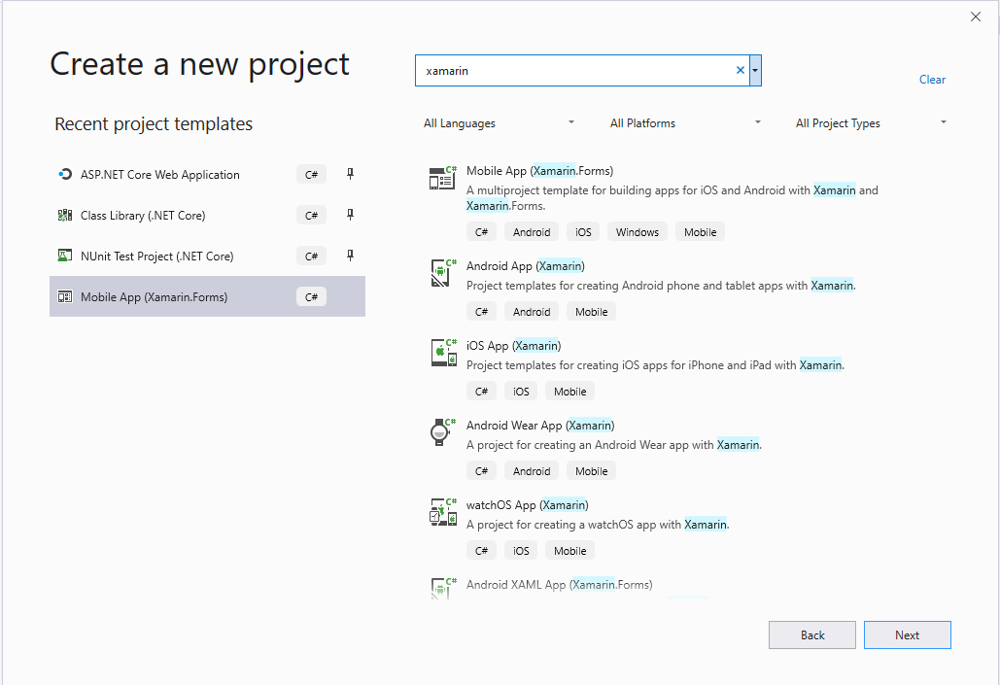
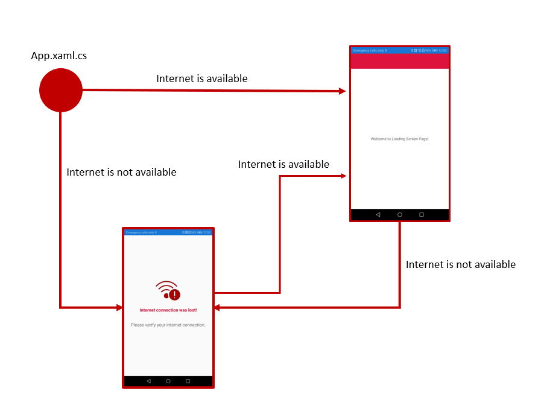

# Mobile StartUp App

## Check if internet is available

Create the **Mobile App (Xamarin.Forms)** as showed in the following image

<MTMarkdownOptions output='html4'>
	
</MTMarkdownOptions>

Then check the following nugets and update them if necessary:

* **Xamarin.Forms**
* **Xamarin.Essentials**

After it, prepare your MobileStartUpApp to use MVVM pattern, creating the following folders:

* **Model**
* **ViewModels**
* **Views**

Move the **MainPage.xaml** from root to **Views**.

Open the **App.xaml.cs** file and change the code to:

        public partial class App : Application
        {
            public App()
            {
                InitializeComponent();           
                       
                HandleApp(Connectivity.NetworkAccess);
                HandInternetConnection();
            }
            private void Connectivity_ConnectivityChanged(object sender, ConnectivityChangedEventArgs e)
            {
                HandleApp(e.NetworkAccess);
            }

            private void HandleApp(NetworkAccess networkAccess)
            {
                if (networkAccess == NetworkAccess.Internet)
                {
                    MainPage = new NavigationPage(new LoadingScreenPage())
                    {
                        BackgroundColor = Color.White,
                        BarBackgroundColor = Color.Crimson,
                        BarTextColor = Color.White,
                        Title = "Mobile Start Up App"
                    };
                }
                else
                {
                    MainPage = new InternetNotAvailablePage();              
                }
            }

            protected override void OnStart()
            {
                // Handle when your app starts
            }

            protected override void OnSleep()
            {
                // Handle when your app sleeps
            }

            protected override void OnResume()
            {
                // Handle when your app resumes
            }
            private void HandInternetConnection()
            {
                Connectivity.ConnectivityChanged += Connectivity_ConnectivityChanged;
            }
        }

Note in this code is used the **Xamarin.Essencials.Connectivity** and you need to create two views to complete the flow:

* **InternetNotAvailablePage.xaml** - This page is used when the connection is not available
* **LoadingScreenPage.xaml** -  This page is used when the connection is available and the app is processing something

At the end the flow should be

<MTMarkdownOptions output='html4'>
	
</MTMarkdownOptions>